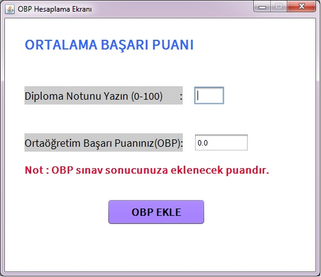
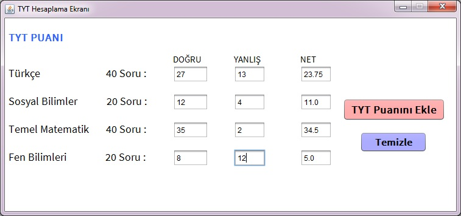
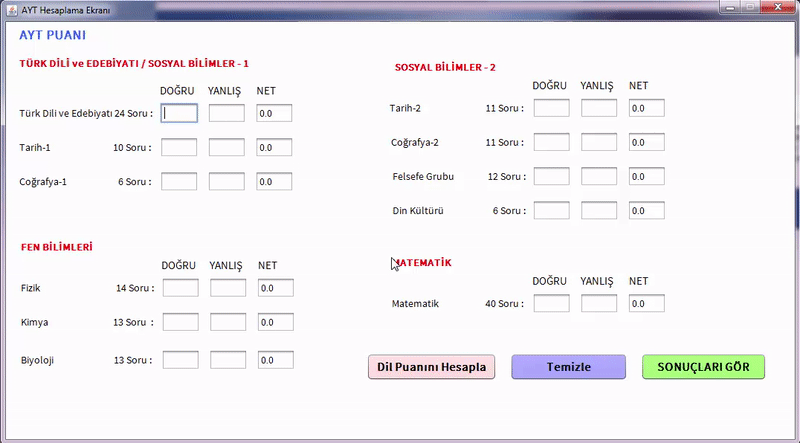
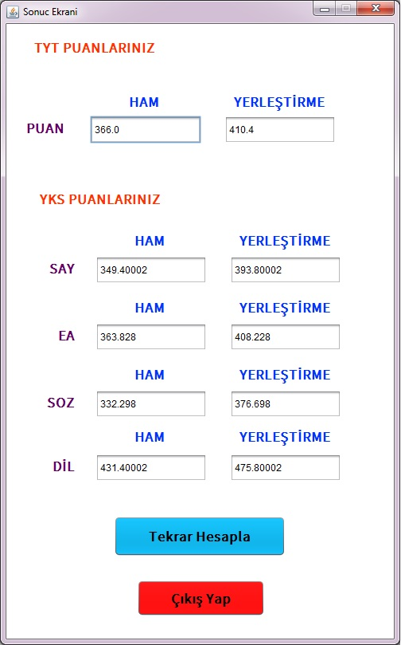

# YKS Puanı Hesaplama Programı

Bu uygulama **_YKS puanını hesaplayan_** ve Java geliştiricilerine **_Swing_** kütüphanesinin işlevlerini göstermede yardımcı olan,
**JFrame Form** kullanılarak ve **Türkçe** olarak hazırlanmış , mini bir projedir. 

## YKS Nedir?

YKS, üniversiteye girişte YGS ve LYS yerine gelen Yükseköğretim Kurumları Sınavı olarak bilinen yeni sistemin adıdır.Yeni sistem ile birlikte adaylar Yükseköğretim Kurumları Sınavı'na giriyorlar. 
- Bu sınav 3 ayrı oturumdan oluşmaktadır.

1. Oturum Temel Yeterlilik Testi (TYT)
2. Oturum Alan Yeterlilik Testi (AYT)
3. Oturum ise Yabancı Dil Testi (YDT) olarak geçmektedir.

## Ekran Görüntüleri

✦**Ortalama Başarı Puanı Hesaplama Ekranı**

  

✦**TYT Netlerinin Hesaplandığı Ekran**

✦**AYT Netlerinin Hesaplandığı Ekran**

✦**Sonuçların Gösterildiği Ekran**

## Kurulum:

Uygulamayı yüklemek için şu adımları izleyin.

- Sağ üstte bulunan Fork butonuna bas.
- "Clone or download" bölümünden dosyayı indir veya aşağıdaki komutu yazarak bu projeyi kopyala.                   

      git clone https://github.com/emreziplar/YKSPuaniHesaplama.git
- Projeyi Netbeans'de aç.
#### veya 
- Kullanıcı iseniz [buradan](https://github.com/emreziplar/YKSPuaniHesaplama/blob/master/dist/YKSPuanHesaplama.jar?raw=true) indirin.

### Hepsi bu kadar !

# İyi Çalışmalar ツ

